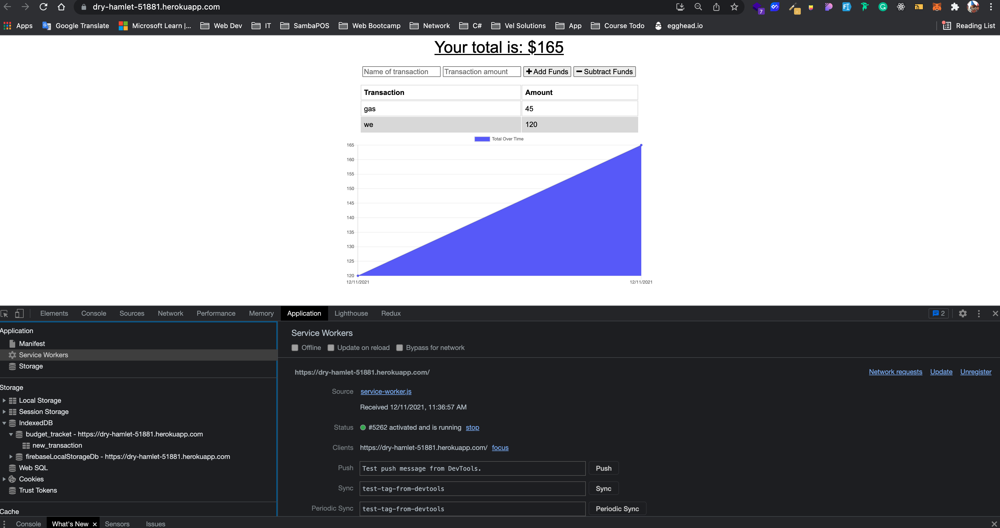

# budget-Tracker

## Description

This project helps you to track your expenses in travel, party or any occasion of your life you want or need be accounting.
This project includes a PWS functionality helping you continue tracking your expenses, including those moments in your life when you don't have an internet connection or you are offline.

## Table of Contents

- [Usage](#usage)
- [Questions](#questions)
- [License](#license)

## Usage

pease visit the project live url and sign up https://dry-hamlet-51881.herokuapp.com/

## Contributing

You can participate in this project, submiting bugs, and feature request. Also you can help testing this project using jest.

## Questions

for any questions feel free to contact me to joseduardo15062005@gmail.com

checkout the [GitHub profile](https://github.com/joseduardo15062005)

## License

Code released under the MIT License [License](https://choosealicense.com/licenses/mit/).
for additional questions please feel free to contact us via email at joseduardo15062005@gmail.com
